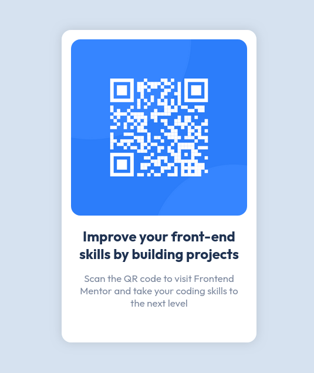

# Frontend Mentor - QR code component solution

This my solution to the [QR code component challenge on Frontend Mentor](https://www.frontendmentor.io/challenges/qr-code-component-iux_sIO_H). Frontend Mentor challenges help you improve your coding skills by building realistic projects. 

## Table of contents

- [Overview](#overview)
  - [Screenshot](#screenshot)
- [My process](#my-process)
  - [Built with](#built-with)
  - [What I learned](#what-i-learned)
  - [Useful resources](#useful-resources)
- [Author](#author)
- [Acknowledgments](#acknowledgments)

## Overview

### Screenshot

## My process

### Built with

- Semantic HTML5 markup
- Vanilla CSS
- CSS Grid

### What I learned

- CSS Custom Properties for storing color values
- Viewport units (`vh`, `svh`, etc.)
- Box Shadow
- [Block, Element, Modifier](https://css-tricks.com/bem-101/) naming convention

### Useful resources

- [BEM 101](https://css-tricks.com/bem-101/) - This article helped me learn the naming convention a lot of web developers use for CSS class names
- [CSS Variables - An introduction to CSS custom properties](https://youtu.be/PHO6TBq_auI?list=PL4-IK0AVhVjOT2KBB5TSbD77OmfHvtqUi) - This video showed me the basics of using CSS variables to store colors that are reusable throughout the stylesheet.
- [Best practice for centering a block component vertically? (Discord)](https://discord.com/channels/824970620529279006/1165445943232045126) - This post I made in the `#best-practices` channel of the Frontend Mentor Discord server helped me come up with a solution for centering a single component vertically and horizontally
	- Join the [Frontend Mentor Discord server](https://discord.gg/UAfh3qzhYb) to view this

## Author

- Frontend Mentor - [\@grifb](https://www.frontendmentor.io/profile/grifb)

## Acknowledgments

- [\@Islandstone89](https://www.frontendmentor.io/profile/Islandstone89) - Helped me vertically center the QR card component